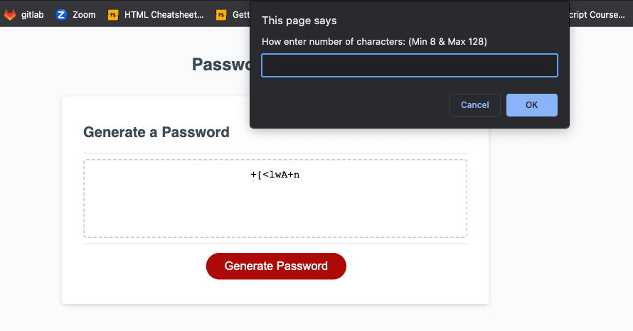

# Personal Portfoilio

## Description

This is a password generator. User selects desire length and desire criteria. User may select password to contain lower/upper case letters, numbers and symbols. Generator requres a minimum of 8 characters and a max of 128. Once desire criteria has been set, generator will print password. 

## Installation

N/A

## Usage
Generate passowrds 

## Screenshot 

## Deployment link

https://ayrh1.github.io/JS-PasswordGenerator/

## Credits

* [MDN Web Docs on window.alert()](https://developer.mozilla.org/en-US/docs/Web/API/Window/alert)

* [MDN Web Docs on window.confirm()](https://developer.mozilla.org/en-US/docs/Web/API/Window/confirm)

* [MDN Web Docs on window.prompt()](https://developer.mozilla.org/en-US/docs/Web/API/Window/prompt)

* [MDN Web Docs on Math](https://developer.mozilla.org/en-US/docs/Web/JavaScript/Reference/Global_Objects/Math)

## License

Please refer to the LICENSE in the repo.
